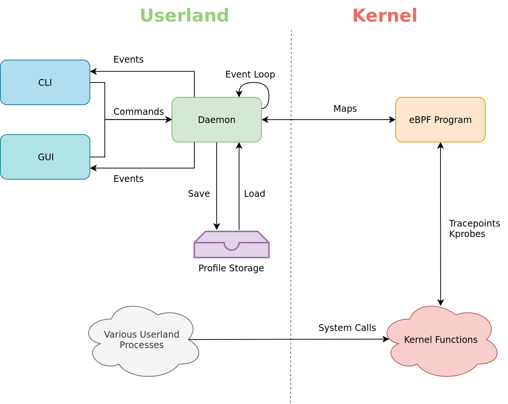
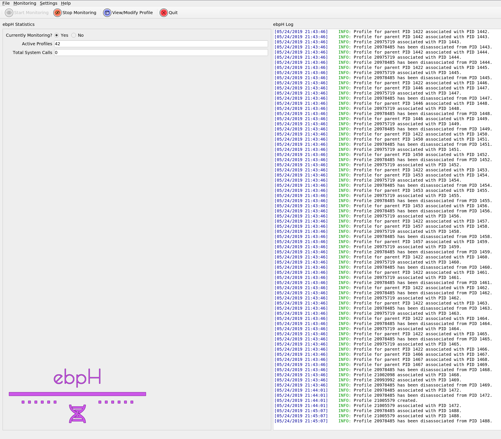

```{r,include=FALSE}
knitr::opts_chunk$set(echo = FALSE)
options(kableExtra.latex.load_packages = FALSE)
library(kableExtra)
library(lubridate)
```
<!-- Setup -->
\pagestyle{fancy}
\counterwithin{lstlisting}{section}
\renewcommand{\maketitle}{\oldmaketitle}

\makeatletter
\def\@maketitle{
\begin{center}
{\Huge \@title \par}
{\Large COMP4906 Honours Thesis Proposal}
\vskip 1.5em
by
\vskip 1.5em
{\large \bfseries\@author}
\vskip 0.5em
{\large \itshape \thedate}
\vfill
Under the supervision of Dr.\ Anil Somayaji\\
Carleton University
\vfill
\end{center}
}
\makeatother

<!-- Title page -->
\maketitle
\thispagestyle{empty}

\onehalfspacing

\clearpage
\pagenumbering{roman}
\section*{Abstract}
\markboth{Abstract}{}

System introspection is becoming an increasingly attractive option
for maintaining operating system stability and security. This is primarily
due to the many recent advances in system introspection technology; in particular,
the 2013 introduction of *eBPF* (*Extended Berkeley Packet Filter*)
into the Linux Kernel [@starovoitov13] along with the recent
development highly usable interfaces such as *bcc* (*BPF Compiler Collection*)
[@bcc] has resulted in highly compelling,
performant, and (perhaps most importantly) safe subsystem for both kernel and userland
instrumentation.

The proposed thesis seeks to test the limits of what eBPF programs are capable of
with respect to the domain of computer security; specifically, I present *ebpH*,
an eBPF-based intrusion detection system based on Anil Somayaji's
[@soma02] *pH* (*Process Homeostasis*). Preliminary testing
has shown that ebpH is able to detect anomalies in process behavior by instrumenting
system call tracepoints with negligible overhead. Future work will involve testing and
iterating on the ebpH prototype, as well as the implementation of several kernel patches
to further extend its functionality.

#### Keywords:

eBPF, intrusion detection, system calls, Linux Kernel introspection

\newpage
\section*{Acknowledgments}
\markboth{Acknowledgments}{}

First and foremost, I would like to thank my advisor, Anil Somayaji, for his
tireless efforts to ensure the success of this project, as well as for providing
the original design for pH along with invaluable advice and ideas. Implementing ebpH
and writing this proposal has been a long process and not without its challenges.
Dr. Somayaji's support and guidance has been quintessential to the success of this
undertaking.

I would also like to thank the members and contributors of the *Iovisor Project*,
especially Yonghong Song (https://github.com/yonghong-song) and Teng Qin (https://github.com/palmtenor)
for their guidance and willingness to respond to issues and questions related to the *bcc* project.
Sasha Goldstein's (https://github.com/goldshtn) *syscount.py* was also an invaluable basis for my earliest proof-of-concept experimentation.
although none of that original code has made it into this iteration of ebpH.

For their love and tremendous support of my education, I would like to thank my parents,
Mark and Terri-Lyn.
Finally, I want to thank my dear friend, Amanda, for all the support she has provided me throughout
my University career. I couldn't have made it this far without you.

<!-- Table of contents -->
\newpage
\tableofcontents

<!-- List of figs, tables, listings -->
\newpage
\listoffigures
\newpage
\listoftables
\newpage
\lstlistoflistings

<!-- Setup the rest of the document -->
\newpage
\pagenumbering{arabic}
\setcounter{page}{1}

# Introduction and Motivation

As our computer systems grow increasingly complex, so too does it
become more and more difficult to gauge precisely what they are doing
at any given moment. Modern computers are often running hundreds, if not thousands
of processes at any given time, the vast majority of which are running silently in
the background. As a result, users often have a very limited notion of what exactly
is happening on their systems, especially beyond that which they can actually see
on their screens. An unfortunate corollary to this observation is that
users *also* have no way of knowing whether their system may be *misbehaving*
at a given moment, whether due to a malicious actor, buggy software, or simply
some unfortunate combination of circumstances.

Recently, a lot of work has been done to help bridge this gap between
system state and visibility, particularly through the introduction of
powerful new tools such as *Extended Berkeley Packet Filter* (eBPF).
Introduced to the Linux Kernel in a 2013 RFC and subsequent kernel patch [@starovoitov13],
eBPF offers a promising interface for kernel introspection, particularly given its
scope and unprecedented level of safety therein; although eBPF can examine
any data structure or function in the kernel through the instrumentation of tracepoints,
its safety is guaranteed via a bytecode verifier. What this means in practice is that we
effectively have unlimited, highly performant, production-safe system
introspection capabilities that can be used to monitor as much or as little
system state as we desire.

Certainly, eBPF offers unprecedented system state visibility, but this is only scratching
the surface of what this technology is capable of. With limitless tracing capabilities,
we can construct powerful applications to enhance system security, stability, and performance.
In theory, these applications can perform much of their work autonomously in the background, but
are equally capable of functioning in a more interactive role, keeping the end user informed
about changes in system state, particularly if these changes in state are undesired. To that end,
I propose *ebpH* (a portmanteau of eBPF and pH), an intrusion detection system
based entirely on eBPF that monitors process state in the form of system call sequences.
By building and maintaining per-executable behavior profiles, ebpH can dynamically detect when
processes are behaving outside of the status quo, and notify the user so that they can understand
exactly what is going on.

A prototype of ebpH has been written using the Python interface provided by *bcc* (*BPF Compiler Collection*) [@bcc],
and preliminary tests show that it is capable of monitoring system state under moderate to heavy workloads with negligible
overhead. What's more, zero kernel panics occurred during ebpH's development and early testing, which simply
would not have been possible without the safety guarantees that eBPF provides. The rest of this
proposal will cover the necessary background material required to understand ebpH, describe
several aspects of its implementation, including the many findings and pitfalls encountered along the way,
and discuss the planned methodology for testing and iterating on this prototype going forward.

# Background

In the following sections, I will provide the necessary background information needed
to understand ebpH; this includes an overview of system introspection and tracing techniques
on Linux including eBPF itself, and some background on system calls and intrusion detection.

While my work is primarily focused on the use of eBPF for maintaining
system security and stability, the working prototype for ebpH borrows
heavily from Anil Somayaji's *pH* or *Process Homeostais* [@soma02],
an anomaly-based intrusion detection and response system written as a patch for Linux Kernel 2.2.
As such, I will also provide some background on the original pH system and many of the design choices therein.

## An Overview of the Linux Tracing Landscape

System introspection is hardly a novel concept; for years, developers
have been thinking about the best way to solve this problem and have come up
with several unique solutions, each with a variety of benefits and drawbacks.
\autoref{introspection-summary} presents an overview of some prominent examples
relevant to GNU/Linux systems.

\begin{table}
\caption{A summary of various system introspection technologies available for GNU/Linux systems.}
\label{introspection-summary}
\begin{center}
\begin{tabular}{|l|p{3.8in}|l|}
\hline
\textbf{Name} & \textbf{Interface and Implementation} & \textbf{Citations}\\
\hline
\hline
strace & Uses the ptrace system call to trace userland processes & \cite{strace, manstrace}  \\
\hline
ltrace & Uses the ptrace system call to trace library calls in userland processes & \cite{rubirabranco07, manltrace}  \\
\hline
SystemTap & Dynamically generates loadable kernel modules for instrumentation; newer versions can optionally use eBPF as a backend instead &  \cite{systemtap, merey17}\\
\hline
ftrace & Sysfs pseudo filesystem for tracepoint instrumentation located at \texttt{/sys/kernel/debug/tracing} & \cite{ftrace}\\
\hline
perf\_events & Linux subsystem that collects performance events and returns them to userspace & \cite{manperfeventopen}  \\
\hline
LTTng & Loadable kernel modules, userland libraries & \cite{lttng}\\
\hline
dtrace4linux & A Linux port of DTrace via a loadable kernel module & \cite{dtrace4linux} \\
\hline
sysdig & Loadable kernel modules for system monitoring; native support for containers & \cite{sysdig} \\
\hline
eBPF & In-kernel virtual machine for running pre-verified bytecode & \cite{bcc, goldstein16, starovoitov13} \\
\hline
\end{tabular}
\end{center}
\end{table}

These technologies can, in general, be classified into a few broad categories (\autoref{instr-cmp}),
albeit with potential overlap depending on the tool:

(1) Userland libraries.
(1) Ptrace-based instrumentation.
(1) Loadable kernel modules.
(1) Kernel subsystems.

\begin{figure}
\begin{center}
\includegraphics[keepaspectratio, height=3.2in]{../figures/instr-cmp.png}
\end{center}
\caption[A high level overview of the broad categories of Linux instrumentation]{
A high level overview of the broad categories of Linux instrumentation.
This does not represent a complete picture of all available tools and interfaces,
but instead presents many of the most popular ones. Note how eBPF covers every presented use case.
}
\label{instr-cmp}
\end{figure}

Applications such as strace [@strace; @manstrace] which make use of the ptrace system call are certainly
a viable option for limited system introspection with respect to specific processes.
However, this does not represent a complete solution, as we are limited to monitoring
the system calls made by a process to communicate with the kernel, its memory, and the state of its registers,
rather than the underlying kernel functions themselves [@manptrace]. The scope of ptrace-based solutions is
also limited by ptrace's lack of scalability; ptrace's API is conducive to tracing single processes at a time rather
than tracing processes system wide. Its limited scale becomes even more obvious when considering the high
amount of context-switching between kernel space and user space required when tracing multiple processes or threads,
especially when these processes and threads make many hundreds of system calls per second [@keniston07].

Although library call instrumentation through software such as ltrace [@rubirabranco07; @manltrace]
does not necessarily suffer from the
same performance issues as described above, it still constitutes a suboptimal solution for many
use cases due to its limited scope. In order to be effective and provide a complete picture of what
exactly is going on during a given process' execution, library tracing needs to be combined with other solutions.
In fact, ltrace does exactly this; when the user specifies the \texttt{-S} flag, ltrace uses the ptrace system call
to provide strace-like system call tracing functionality.

LKM-based implementations such as sysdig [@sysdig] and SystemTap [@systemtap] offer an extremely
deep and powerful tracing solution given their ability to instrument the entire system, including
the kernel itself. Their primary detriment is a lack of safety guarantees with respect to the modules
themselves. No matter how vetted or credible a piece of software might be, running it natively in
the kernel always comports with an inherent level of risk; buggy code might cause system failure,
loss of data, or other unintended and potentially catastrophic consequences.

Custom tracing solutions through kernel modules carry essentially the same risks.
No sane manager would consent to running untrusted, unvetted code natively in the kernel
of a production system; the risks are simply too great and far outweigh the benefits.
Instead, such code must be carefully examined, reviewed, and tested, a process which
can potentially take months. What's more, even allowing for a careful testing and vetting
process, there is always some probability that a bug can slip through the cracks, resulting
in the catastrophic consequences outlined above.

Built-in kernel subsystems for instrumentation seem to be the most desirable choice of any
of the presented solutions. In fact, eBPF [@starovoitov13] itself constitutes one such solution. However,
for the time being, we will focus on a few others, namely ftrace [@ftrace] and perf\_events [@manperfeventopen]
(eBPF programs actually *can* and *do* use both of these interfaces anyway). While both of these solutions are
safe to use (assuming we trust the user), they suffer from limited documentation and relatively poor user interfaces.
These factors in tandem mean that ftrace and perf\_events, while quite useful for a variety of system introspection
needs, are less extensible than other approaches.

### Dtrace

It is worth spending a bit more time comparing eBPF with Dtrace, as both
APIs are quite full-featured and designed with similar functionality in mind.
dtrace4linux [@dtrace4linux] is a free and open source port of Sun's Dtrace for the
Linux Kernel, implemented as a loadable kernel module (LKM). While Dtrace offers
a powerful API for full-system tracing, its usefulness is, in general, eclipsed by
that of eBPF [@gregg18] and requires extensive shell scripting for use cases beyond
one-line tracing scripts. In contrast, with the help of powerful and easy to use
front ends like bcc [@bcc], developing complex eBPF programs for a wide variety of use cases
is becoming an increasingly painless process.

Not only does eBPF cover more complex use cases than Dtrace, but it also
provides support for simple one-line programs through tools like bpftrace [@gregg18; @bpftrace]
which has been designed to provide a high-level Dtrace-like tracing language
for Linux using eBPF as a backend. Although bpftrace only provides a subset of
Dtrace's functionality [@gregg18], its feature set has been carefully curated in order
to cater to the most common use cases and more functionality is being added
on an as-needed basis.

Additional work is being done to fully reimplement Dtrace as a new BPF program type
[@vanhees19] which will further augment eBPF's breadth and provide full
backward compatibility for existing Dtrace scripts to work with eBPF.
This seems to be by far the most promising avenue for Linux Dtrace support thus far,
as it seeks to combine the advantages of Dtrace with the speed, power, and safety of eBPF.

\FloatBarrier

## eBPF: Linux Tracing Superpowers

In 2016, eBPF was described by Brendan Gregg [@gregg16]
as nothing short of *Linux tracing superpowers*.
I echo that sentiment here, as it summarizes eBPF's capabilities perfectly.
Through eBPF programs, we can simultaneously trace userland symbols and library
calls, kernel functions and data structures, and hardware performance. What's more,
through an even newer subset of eBPF, known as *XDP* or *Express Data Path* [@xdp], we
can inspect, modify, redirect, and even drop packets entirely before they even reach the main kernel network stack.
\autoref{ebpf-use-cases} provides a high level overview of these use cases and the corresponding
eBPF instrumentation required.

\begin{figure}
\includegraphics{../figures/eBPF-use-cases.png}
\caption[A high level overview of various eBPF use cases]{
A high level overview of various eBPF use cases.
Note the high level of flexibility that eBPF provides
with respect to system tracing.}
\label{ebpf-use-cases}
\end{figure}

The advantages of eBPF extend far beyond scope of traceability; eBPF
is also extremely performant, and runs with guaranteed safety.
In practice, this means that eBPF is an ideal tool for use in
production environments and at scale.

Safety is guaranteed with the help of an in-kernel verifier that
checks all submitted bytecode before its insertion into the BPF virtual machine.
While the verifier does limit what is possible (eBPF in its current state is **not** Turing complete), it is constantly being
improved; for example, a recent patch [@starovoitov19] that was mainlined in the Linux 5.3 kernel
added support for verified bounded loops, which greatly increases the computational possibilities of eBPF.
The verifier will be discussed in further detail in \autoref{verifier-section}.

eBPF's superior performance can be attributed to several factors.
On supported architectures,\footnote{x86-64, SPARC, PowerPC, ARM, arm64, MIPS, and s390 \cite{fleming17}}
eBPF bytecode is compiled into machine code using a *just-in-time* (*JIT*)
compiler; this both saves memory and reduces the amount of time it takes
to insert an eBPF program into the kernel. Additionally, since eBPF runs in-kernel
and communicates with userland via map access and perf events, the number of context switches
required between userland and the kernel is greatly diminished, especially compared to approaches
such as the ptrace system call.

### How eBPF Works at a High Level

From the perspective of a user, the eBPF workflow is surprisingly simple.
Users can elect to write eBPF bytecode directly (not recommended) or use one
of many front ends to write in higher level languages that are then used to
generate the respective bytecode. bcc [@bcc] offers front ends for several languages including
Python, Go, C/C++; users write eBPF programs in C and interact with bcc's API
in order to generate eBPF bytecode and submit it to the kernel.

\autoref{ebpf-topology} presents an overview of the eBPF workflow with respect to
the interaction between userland applications and eBPF programs.
Considering bcc's Python front end as an example: The user writes
their BPF program in C and a user interface in Python. Using a provided
BPF class, the C code is used to generate bytecode which is then submitted
to the verifier to be checked for safety. Assuming the BPF program passes
all required checks, it is then loaded into an in-kernel virtual machine. From there,
we are able to attach onto various probes and tracepoints, both in the kernel and in userland.

\begin{figure}
\includegraphics{../figures/eBPF-topology.png}
\caption[Basic topology of eBPF with respect to userland and the kernel]{
Basic topology of eBPF with respect to userland and the kernel.
Note the bidirectional nature of dataflow between userspace and kernelspace
using maps.}
\label{ebpf-topology}
\end{figure}

The main data structure used in eBPF is the map; these maps are used to store
data as well as for communication between userspace and the eBPF program. There are several
map types available in eBPF programs which cover a wide variety of use cases.
These map types along with a brief description are provided in \autoref{ebpf-maps} [@man-bpf; @fleming17; @bcc].
Thanks to this wide arsenal of maps, eBPF developers have a powerful set of both general-purpose
and specialized data structures at their disposal; as we will see in coming sections,
many of these maps are quite versatile and have use cases beyond what might initially
seem pertinent. For example, the `ARRAY` map type may be used to initialize large data structures
to be copied into a general purpose `HASH` map (refer to \autoref{appendix-bigdata} in \autoref{ebpf-design-patterns}).
This can be effectively used to bypass the verifier's stack space limitations, which are discussed in detail
in \autoref{verifier-section}.

\begin{table}
\small
\begin{center}
\caption{Various map types available in eBPF programs.}
\label{ebpf-maps}
\begin{tabular}{|l|p{4.6in}|}
\hline
\textbf{Map Type} & \textbf{Description}\\
\hline
\hline
\texttt{HASH} & A hashtable of key-value pairs\\
\hline
\texttt{ARRAY} & An array indexed by integers; members are zero-initialized\\
\hline
\texttt{PROG\_ARRAY} & A specialized array to hold file descriptors to other BPF programs; used for tail calls\\
\hline
\texttt{PERF\_EVENT\_ARRAY} & Holds perf event counters for hardware monitoring\\
\hline
\texttt{PERCPU\_HASH} & Like \texttt{HASH} but stores a different copy for each CPU context\\
\hline
\texttt{PERCPU\_ARRAY} & Like \texttt{ARRAY} but stores a different copy for each CPU context\\
\hline
\texttt{STACK\_TRACE} & Stores stack traces for userspace or kernerlspace functions\\
\hline
\texttt{CGROUP\_ARRAY} & Stores pointers to cgroups\\
\hline
\texttt{LRU\_HASH} & Like a \texttt{HASH} except least recently used values are removed to make space\\
\hline
\texttt{LRU\_PERCPU\_HASH} & Like \texttt{LRU\_HASH} but stores a different copy for each CPU context\\
\hline
\texttt{LPM\_TRIE} & A "Longest Prefix Matching" trie optimized for efficient traversal\\
\hline
\texttt{ARRAY\_OF\_MAPS} & An \texttt{ARRAY} of file descriptors into other maps\\
\hline
\texttt{HASH\_OF\_MAPS} & A \texttt{HASH} of file descriptors into other maps\\
\hline
\texttt{DEVMAP} & Maps the \texttt{ifindex} of various network devices; used in XDP programs\\
\hline
\texttt{SOCKMAP} & Holds references to \texttt{sock} structs; used for socket redirection\\
\hline
\texttt{CPUMAP} & Allows for redirection of packets to remote CPUs; used in XDP programs\\
\hline
\end{tabular}
\end{center}
\end{table}

<!-- TODO: left off here to focus on implementation details. come back to this later -->

\FloatBarrier

### The Verifier: The Good, the Bad, and the Ugly
\label{verifier-section}

The verifier is responsible for eBPF's unprecedented safety, one of its
most attractive qualities with respect to system tracing. While this verifier
is quintessential to the safety of eBPF given its impressive scope and power,
it is not without its drawbacks. In this section, we describe how the verifier works,
its nuances and drawbacks, and recent work that has been done to improve
the verifier's support for increasingly complex eBPF programs.

Proving the safety of arbitrary code is by definition a difficult problem.
This is thanks in part to theoretical limitations on what we can actually prove;
a famous example is the halting problem described by Turing circa 1937 [@turing37].
This difficulty is further compounded by stricter requirements for safety in the context
of eBPF. In fact, the problem that we are effectively trying to solve is one of
*untrusted* code running in the kernel, an implicitly trusted environment.

To illustrate the importance of this problem of safety with respect to eBPF,
let us consider a simple example. We will again consider the halting problem
described above. Suppose we have two eBPF programs, program $A$ and program $B$,
that each hook onto a mission-critical kernel function (`schedule()`, for example).
The only difference between these two programs is that program $A$ always terminates,
while program $B$ runs forever without stopping. Program $B$ effectively constitutes a
denial of service attack [@hussain03] on our system, intentional or otherwise; allowing untrusted
users to load this code into our kernel spells immediate disaster for our system.

While we have established that verifying the safety of eBPF programs is an important problem to solve,
the question remains as to whether it is *possible* to solve.
For the reasons outlined above, this problem should intuitively seem impossible,
or at least far more difficult than should be feasible. So, what can we do? The answer
is to *change the rules* to make it easier. In particular, while it is difficult to prove
that the set of all possible eBPF programs are safe, it is much easier\footnote{\emph{Easier}
here means \emph{computationally easier}, certainly not trivial.}
to prove this property for a subset of all eBPF programs. \autoref{valid-ebpf} depicts
the relationship between potentially valid eBPF code and verifiably valid eBPF code.

\begin{figure}
\begin{center}
\includegraphics[height=.4\paperheight]{../figures/valid-ebpf.png}
\end{center}
\caption[The set participation of valid C and eBPF programs.]
{
The set participation of valid C and eBPF programs.
Valid eBPF programs written in C constitute a small subset of all valid C programs. Verifiably valid eBPF programs
constitute an even smaller subset therein.
}
\label{valid-ebpf}
\end{figure}

\begin{figure}
\begin{center}
\includegraphics{../figures/complexity-verifiability.png}
\end{center}
\caption[Complexity and verifiability of eBPF programs.]
{
Complexity and verifiability of eBPF programs.
Safety guarantees for eBPF programs rely on certain compromises.
Ideally we would like to have a relationship as shown on the bottom;
in practice, we have something that is getting closer over time, but is still
far from the ideal.
}
\label{complexity-verifiability}
\end{figure}

The immediate exclusion of eBPF programs meeting certain criteria is the crux
of eBPF's safety guarantees. Unfortunately, it also rather intuitively
limits what we are actually able to do with eBPF programs. In particular,
eBPF is not a Turing complete language; it prohibits jump instructions,
cycles in execution graphs, and unverified memory access. Further, we limit
stack allocations to only 512 bytes -- far too small for many practical use cases.
From a security perspective, these limitations are a *good thing*, because they allow us to immediately exclude eBPF
programs with unverifiable safety; but from a usability standpoint, particularly that of a new eBPF
developer, the trade-off is not without its drawbacks.

Fortunately, the eBPF verifier is getting better over time (\autoref{complexity-verifiability}).
When we say *better*, what we mean is that it is able to prove the safety of increasingly complex programs.
Perhaps the best example of this steady improvement is a recent kernel patch [@starovoitov19] that added
support for bounded loops in eBPF programs. With this patch, the set of viable
eBPF programs was *greatly* increased; in fact, ebpH in its current incarnation relies
heavily on bounded loop support. Prior to bounded loops, eBPF programs relied on *unrolling*
loops at compile time, a technique that was both slow and highly limited. This is just one example
of the critical work that is being done to improve the verifier and thus improve eBPF as a whole.

## System Calls

ebpH (and the original pH system upon which it is based) works by instrumenting
*system calls* in order to establish behavioral patterns for all binaries
running on the system. Understanding pH and ebpH requires a reliable mental model
of what a system call is and how programs use them to communicate with the kernel.

At the time of writing this paper, the Linux kernel [@unistd] supports
an impressive 436 distinct system calls, and this number generally grows
with subsequent releases. In general, userspace implements a subset of these
system calls, with the exact specifications varying depending on architecture.

## Intrusion Detection

## Process Homeostasis

### Homeostasis

### Anomaly Detection Through Lookahead Pairs

### System Call Delays

## Other Related Work

# Implementing ebpH

At a high level, ebpH is an intrusion detection system that profiles executable behavior
by sequencing the system calls that processes make to the kernel; this essentially
serves as an implementation of the original pH system described by Somayaji [@soma02].
What makes ebpH unique is its use of an eBPF program for system call instrumentation
and profiling (in contrast to the original pH which was implemented as a Linux 2.2 kernel patch).

ebpH can be thought of as a combination of several distinct components, functioning in two
different parts of the system: userspace, and kernelspace (specifically within the eBPF virtual machine).
In particular it includes a daemon, a CLI, and a GUI (described in \autoref{userspace-components})
as well as an eBPF program (described in \autoref{ebph-profiles} and onwards).
The dataflow between these components is depicted in \autoref{ebph-dataflow}.

In order to implement the ebpH prototype described here, it was necessary to
circumvent several challenges associated with the eBPF verifier and make several
critical design choices with respect to dataflow between userspace and the eBPF
virtual machine running in the kernel.
This section attempts to explain these design choices, describe any specific challenges
faced, and justify why eBPF was ultimately well-suited to an implementation of this nature.

{width=80%}

## Userspace Components

The userspace components of ebpH are comprised of two distinct programs.
The **ebpH Daemon** (*ebpHD*) is responsible for initially compiling and submitting the eBPF program,
as well as communication between userspace and the in-kernel eBPF program. As part of this communication,
it loads existing profiles from the disk and saves new and modified profiles to disk at regular intervals.
Users can interact with the daemon either directly on the command line or using the **ebpH GUI**.
The GUI performs the same basic functions as the command line interface, except it presents information and commands
in the form of a graphical user interface.

### The ebpH Daemon

The ebpH Daemon is implemented as a Python3 script that runs as a daemonized background process.
When started, the daemon uses bcc's Python front end [@bcc] to generate the BPF bytecode responsible for
tracing system calls, building profiles, and detecting anomalous behavior. It then submits this bytecode
to the verifier and JIT compiler for insertion into the eBPF virtual machine.

Once the eBPF program is running in the kernel, the daemon continuously polls a set of specialized BPF maps
called perf buffers which are updated on the occurrence of specific events.
\autoref{bpf-events} presents an overview of the most important events we care about.
As events are consumed, they are
handled by the daemon and removed from the buffer to make room for new events. These buffers offer a lightweight
and efficient method to transfer data from the eBPF program to userspace, particularly since buffering
data significantly reduces the number of required context switches.

\begin{table}
\caption{Main event categories in ebpH.}
\label{bpf-events}
\begin{center}
\begin{tabular}{|l|p{2.6in}|l|}
\hline
\textbf{Event} & \textbf{Description} & \textbf{Memory Overhead}\\
\hline
\hline
\texttt{ebpH\_on\_anomaly} & Reports anomalies in specific processes
and which profile they were associated with & $2^{8} \text{ pages}$\\
\hline
\texttt{ebpH\_on\_create\_profile} & Reports when new profiles are created & $2^{8} \text{ pages}$\\
\hline
\texttt{ebpH\_on\_pid\_assoc} & Reports new associations between PIDs and profiles & $2^{8} \text{ pages}$\\
\hline
\texttt{ebpH\_error} & A generic event for reporting errors to userspace & $2^{2} \text{ pages}$\\
\hline
\texttt{ebpH\_warning} & A generic event for reporting warnings to userspace & $2^{2} \text{ pages}$\\
\hline
\texttt{ebpH\_debug} & A generic event for reporting debug information to userspace & $2^{2} \text{ pages}$\\
\hline
\texttt{ebpH\_info} & A generic event for reporting general information to userspace & $2^{2} \text{ pages}$\\
\hline
\end{tabular}
\end{center}
\end{table}

In addition to perf buffers, the daemon is also able to communicate with the eBPF program through direct
access to its maps. We use this direct access to issue commands to the eBPF program, check program state,
and gather several statistics, such as profile count, anomaly count, and system call count. At the core of ebpH's
design philosophy is the combination of system visibility and security, and so providing as much information
as possible about system state is of paramount importance.

The daemon also uses direct map access to save and load profiles to and from the disk.
Profiles are saved automatically at regular intervals, configurable by the user,
as well as any time ebpH stops monitoring the system.
These profiles are automatically loaded every time ebpH starts.

### The ebpH GUI

The ebpH GUI (hereafter referred to as the GUI) provides a graphical user interface for interacting
with the daemon. This GUI is still a work in progress and will be improved considerably
during the testing and iteration phase (see \autoref{future-iteration}). In its current incarnation,
the GUI can be used to inspect process profiles, examine the overall state of ebpH, and check
the ebpH logs. It can also be used to issue rudimentary commands such as profile deletion.
Future versions of the GUI will include more commands for controlling the state of ebpH,
as well as increased system visibility and more information about process profiles.
\autoref{early-gui} depicts an early version of the GUI.



## ebpH Profiles

In order to monitor process behavior, ebpH keeps track of a unique
profile (\autoref{ebph-profile-struct}) for each executable on the system.
It does this by maintaining a hashmap of profiles, hashed by a unique per-executable ID;
this ID is a 64-bit unsigned integer which is calculated as a unique combination
of filesystem device number and inode number:
\begin{align*}
\texttt{key} &= (\texttt{device number} << 32) + \texttt{inode number}
\end{align*}
where $<<$ is the left bitshift operation. In other words, we take the filesystem's
device ID in the upper 32 bits of our key, and the inode number in the lower 32 bits.
This method provides a simple and efficient way to uniquely map keys to profiles.

\begin{lstlisting}[language=c, label={ebph-profile-struct}, caption={A simplified
definition of the ebpH profile struct.}]
struct ebpH_profile
{
    u8 frozen;          /* Is the profile frozen? */
    u8 normal;          /* Is the profile normal? */
    u64 normal_time;    /* Minimum system time required for normalcy */
    u64 normal_count;   /* Normal syscall count */
    u64 last_mod_count; /* Syscalls since profile was last modified */
    u64 train_count;    /* Syscalls seen during training */
    u64 anomalies;      /* Number of anomalies in the profile */
    u8 flags[SYSCALLS][SYSCALLS]; /* System call lookahead pairs */
    u64 key;            /* Uniquely computed executable key */
    char comm[16];      /* Name of the executable file */
};
\end{lstlisting}

The profile itself is a C data structure that keeps track of information about the
executable, as well as a sparse two-dimensional away of lookahead pairs [@soma07] to
keep track of system call patterns. Each entry in this array consists of an
8-bit integer, with the $i^\text{th}$ bit corresponding to a previously observed
distance $i$ between the two calls. When we observe this distance, we set the corresponding bit
to `1`. Otherwise, it remains `0`. Each profile maintains lookahead pairs for each possible pair of
system calls. \autoref{lookahead-ls} presents a sample (`read`, `close`) lookahead pair for the `ls` binary.

\begin{figure}
\begin{center}
\includegraphics[height=0.45\paperheight]{../figures/lookahead-ls.png}
\end{center}
\caption[A sample (\lstinline{read}, \lstinline{close}) lookahead pair in the ebpH profile for \lstinline{ls}.]
{
A sample (\lstinline{read}, \lstinline{close}) lookahead pair in the ebpH profile for \lstinline{ls}.
(a) shows the lookahead pair and (b) shows two relevant system call sequences, separated by several omitted calls.
Note that the first three system calls in both the first and second sequence are responsible for
the two least significant bytes of the lookahead pair.
}
\label{lookahead-ls}
\end{figure}

Each process (\autoref{tracing-processes}) is associated with
exactly one profile at a time. Profile association is updated whenever
we observe a process making a call to `execve`. Whenever a process makes
a system call, ebpH looks up its associated profile, and sets the appropriate
lookahead pairs according to the process' most recent system calls. This forms
the crux of how ebpH is able to monitor process behavior.

Just like in the original pH [@soma02], profile state is tracked using the `frozen` and `normal` fields.
When a profile's behavior has stabilized, it is marked frozen. If a profile
has been frozen for one week (i.e. system time has reached `normal_time`),
the profile is then marked normal. Profiles are unfrozen when new behavior is
observed and anomalies are only flagged in normal profiles.

## Tracing Processes

Like profiles, process information is also tracked through a global hashmap of process
structs. The process struct's primary purpose is to maintain the association between
a process and its profile, maintain a sequence of system calls, and keep track of various metadata.
See \autoref{ebph-process-struct} for a simplified definition of the ebpH process struct.

\begin{lstlisting}[language=c, label={ebph-process-struct}, caption={A simplified
definition of the ebpH process struct.}]
struct ebpH_process
{
    long seq[9];  /* Remember 9 most recent system calls in order */
    u8 count;     /* How many system calls are in our sequence? */
    u32 pid;      /* What is our PID? */
    u64 profile_key; /* Associated profile key */
    u8 in_execve; /* Are we in the middle of an execve? */
};
\end{lstlisting}

ebpH monitors process behavior by instrumenting tracepoints for both system call entry and return.
The nine most recent system calls made by each process are stored in its respective
process struct, and are used to set the correct lookahead pairs in the associated profile
struct.

While we keep track of every system call made by a process, we pay special attention to a select few system
calls which are directly related to profile creation, association, and disassociation. These system calls
and their respective side effects are summarized in \autoref{ebph-syscalls}.

\begin{table}
\caption{Important system calls in ebpH.}
\label{ebph-syscalls}
\begin{center}
\begin{tabular}{|l|p{2.4in}|p{2.6in}|}
\hline
\textbf{System Call} & \textbf{Description} & \textbf{ebpH Side Effect}\\
\hline
\hline
\texttt{execve} & Execute a program & \multirow{2}{2.6in}{(Re)associate a process with a profile, creating the profile if necessary}\\
\cline{1-2}
\texttt{execveat} & Execute a program & \\
\hline
\texttt{exit} & Terminate the calling process & \multirow{2}{2.6in}{Stop tracing a process} \\
\cline{1-2}
\texttt{exit\_group} & Terminate all threads in a process &\\
\hline
\texttt{fork} & Create a new process by duplicating calling process & \multirow{3}{2.6in}{Start tracing a process and associate with parent's profile}\\
\cline{1-2}
\texttt{vfork} & Create a child process and block parent &\\
\cline{1-2}
\texttt{clone} & Create a new process or thread &\\
\hline
\end{tabular}
\end{center}
\end{table}

#### Profile Creation and Association with `execve` and `execveat`
There are several important considerations here. First, we need a way to assign profiles
to processes, which is done by instrumenting the `execve` system call using a tracepoint,
as well as part of its underlying implementation via a kprobe. In particular, we hook
the `do_open_execat` kernel function in order to access the file's inode and filesystem
information; without this, we would be unable to differentiate two paths that look like
`/usr/bin/ls` and `./ls`.

The entry and exit points to the `execve` system call are used to differentiate a true
`execve` call from the kernel routines responsible for loading shared libraries, which both
invoke the aforementioned `do_open_execat` subroutine. When we first hit an `execve`,
we set an indicator variable in the process struct to say that we are in the middle of an `execve`.
Subsequent calls to `do_open_execat` are then ignored until we hit `execve`'s return tracepoint
and unset the indicator variable.

#### Reaping Processes with `exit`, `exit_group`, and Signals
We use a combination of system call tracepoints and signal handler kprobes in order
to determine when to stop tracing a particular PID. This is important for a few reasons,
primarily due to map size considerations; by reaping process structs from our map as we are
finished with them we ensure that:

a) the map never fills up and;
b) the map does not consume more memory than necessary.

Processes are reaped from ebpH's map whenever it detects an `exit` or `exit_group` system call.
Threads are reaped whenever we observe a `SIGTERM` or `SIGKILL` signal, the latter of which forms
the underlying implementation for `exit_group`. <!-- TODO: verify this, provide citation -->

#### Profile Association with `fork`, `vfork`, and `clone`
The final special consideration is with respect to `fork` and `clone` family system calls.
In particular,
we want to be able to track child process behavior as well as parent process behavior.
In order to accomplish this, we instrument tracepoints for the `fork`, `vfork`, and `clone`
system calls, ensuring that we associate the child process with the parent's profile, if it
exists. If ebpH detects an `execve` as outlined above, it will simply overwrite the
profile association provided by the initial fork.

## Soothing the Verifier

## Training, Testing, and Anomaly Detection

ebpH profiles are tracked in two phases, *training mode* and *testing mode*.
Profile data is considered training data until the profile becomes normal (as described in \autoref{ebph-profiles}).
Once a profile is in testing mode, the lookahead pairs generated by its associated processes
are compared with existing data. When mismatches occur, they are flagged as anomalies which are reported
to userspace via a perf event buffer. The detection of an anomaly also prompts ebpH
to remove the profile's normal flag and return it to training mode.

### A Simple Example of ebpH Anomaly Detection

As an example, consider the simple program shown in \autoref{anomaly.c}.
This program's normal behavior is to simply print a message to the terminal.
However, when issued an extra argument (in practice, this could be a secret keyword
for activating a backdoor), it prints one extra message. This will cause a noticeable
change in the lookahead pairs associated with the program's profile, and this will be flagged
by ebpH if the profile has been previously marked normal.

\lil[language=c, label={anomaly.c}, caption={A simple program to demonstrate anomaly detection in ebpH.}]{../experiments/anomaly/anomaly.c}

In order to test this, we artificially lower ebpH's normal time to three seconds instead of one week.
Then, we run our test program several times with no arguments to establish normal behavior. Once the profile
has been marked as normal, we then run the same test program with an argument to produce the anomaly.
ebpH immediately detects the anomalous system calls and flags them.
These anomalies are then reported to userspace via a perf buffer as shown in \autoref{anomaly-flag}.


From here, we can figure out exactly what went wrong by inspecting the system call sequences produced by `anomaly.c`
in both cases and comparing them with their respective lookahead pair patterns. \autoref{anomaly-lookahead-comp}
provides an example of this comparison.

While this contrived example is useful for demonstrating ebpH's anomaly detection,
process behavior in practice is often more nuanced. ebpH collects at least a week's worth of
data about a processes system calls before marking it normal, which often corresponds with several branches of execution.
In a real example, the multiple consecutive write calls might be a perfectly normal execution path for this process;
by ensuring that we take our time before deciding whether a process' profile has reached acceptable maturity for testing,
we dramatically decrease the probability of any false positives.

\begin{figure}
\begin{center}
\includegraphics[height=0.45\paperheight]{../figures/lookahead-anomaly.png}
\end{center}
\caption[Two sample (\lstinline{write}, \lstinline{write}) lookahead pairs in the ebpH profile for \lstinline{anomaly.c}.]
{
Two sample (\lstinline{write}, \lstinline{write}) lookahead pairs in the ebpH profile for \lstinline{anomaly.c}.
(a) shows the lookahead pair and (b) shows two relevant system call sequences. The left hand side depicts normal program
behavior, while the right hand side depicts our artificially generated anomaly.
There are several other anomalous lookahead pairs which result from this extra write call, but we focus
on (\lstinline{write}, \lstinline{write}) for simplicity.
}
\label{anomaly-lookahead-comp}
\end{figure}

# Methodology

# Future Iteration

## Improvements to ebpH

## Improvements to the ebpH GUI

<!-- References -->
\clearpage
\addcontentsline{toc}{section}{References}
\printbibliography
\renewcommand{\printbibliography}{\relax}
\clearpage

\appendix

# eBPF Design Patterns

\lil[language=c, caption={Handling large data types in eBPF programs.}, label={appendix-bigdata}]{../code/design_patterns/bigdata.c}

\FloatBarrier

# <!-- Ugly hack to suppress bib at the end -->
